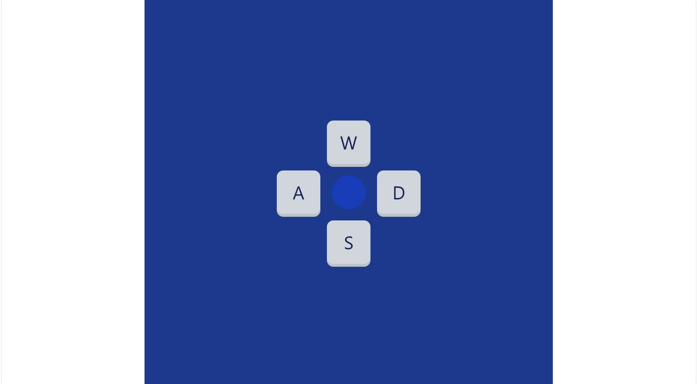

# React Robot Controller

This is a lightweight web-based control via browser built with React + Vite + Tailwind to navigate your robot.

# Demo features

- Control robot via browser
- Realistic 3D button UI
- Live command feedback in the browser console

# Website 
Live Demo: https://my-control-web.vercel.app

## 📸 Screenshot

# Installation
1. clone or copy the button.jsx file into your project.
2. Make sure you install npm and Tailwind in your project.
3. import button.jsx file in your main App file and npm run dev in your terminal.